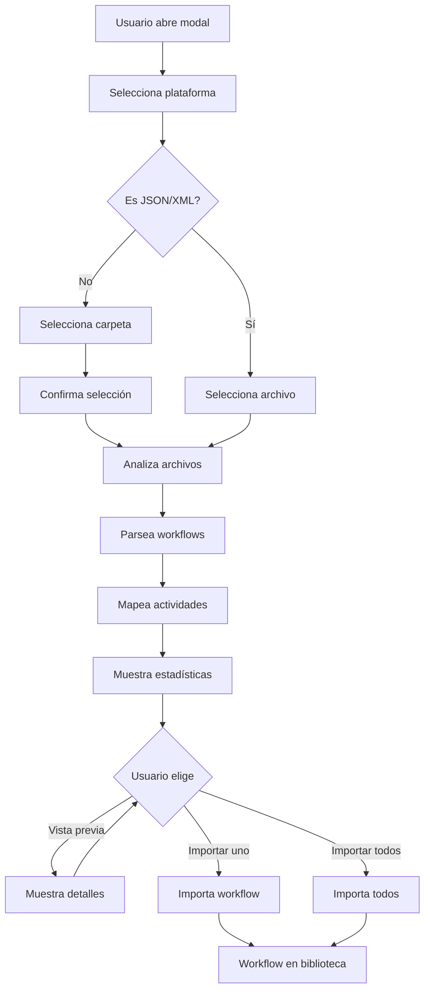

# 🚀 Sistema de Migración Multi-Plataforma RPA

Sistema completo de migración de workflows desde múltiples plataformas RPA a Alqvimia.

## 📋 Plataformas Soportadas

### 1. 🤖 UiPath
- **Archivos**: `.xaml`
- **Archivo de proyecto**: `project.json`
- **Capacidades**:
  - Parseo completo de archivos XAML
  - Mapeo de 30+ actividades UiPath
  - Conversión de selectores UiPath a CSS
  - Preservación de configuraciones y propiedades

### 2. 🔶 Automation Anywhere
- **Archivos**: `.atmx`, `.bot`
- **Archivo de proyecto**: `metadata.json`
- **Capacidades**:
  - Parseo de estructura JSON de bots
  - Mapeo de acciones principales
  - Conversión de atributos a configuración

### 3. 💠 Blue Prism
- **Archivos**: `.bprelease`, `.xml`
- **Archivo de proyecto**: `process.xml`
- **Capacidades**:
  - Parseo XML de procesos
  - Mapeo de stages a componentes
  - Extracción de flujo de proceso

### 4. 🚀 Rocket Software
- **Archivos**: `.xml`, `.rocket`
- **Archivo de proyecto**: `workflow.xml`
- **Capacidades**:
  - Parseo XML de workflows
  - Mapeo de acciones a componentes
  - Conversión de configuraciones

### 5. 🐍 Python Scripts
- **Archivos**: `.py`
- **Archivo principal**: `main.py`
- **Capacidades**:
  - Análisis de imports (Selenium, Requests, etc.)
  - Detección de patrones comunes (click, send_keys, etc.)
  - Conversión de scripts a workflows visuales
  - Preservación de código completo en componentes custom

### 6. 📄 JSON/XML Genérico
- **Archivos**: `.json`, `.xml`
- **Capacidades**:
  - Importación directa de workflows exportados
  - Formato personalizado Alqvimia

## 🎯 Características Principales

### ✨ Selector Visual de Carpeta
- **No más copy/paste**: Interfaz visual para seleccionar carpetas
- **API de navegador**: Usa `webkitdirectory` para selección nativa de carpetas
- **Vista previa**: Muestra la ruta seleccionada y cantidad de archivos
- **Validación**: Verifica archivos requeridos antes de procesar

### 🔍 Análisis Inteligente
- **Detección automática**: Identifica tipo de plataforma por extensiones
- **Validación de estructura**: Verifica archivos de proyecto requeridos
- **Estadísticas en tiempo real**: Muestra progreso del análisis
- **Manejo de errores**: Continúa procesando si un archivo falla

### 📊 Mapeo Avanzado
- **Mapeo por plataforma**: Cada plataforma tiene su diccionario de mapeo
- **Componentes existentes**: Reutiliza componentes Alqvimia existentes
- **Custom components**: Crea componentes nuevos para actividades no mapeadas
- **Tasa de mapeo**: Muestra porcentaje de actividades mapeadas exitosamente

### 👁️ Vista Previa y Control
- **Vista previa individual**: Revisa cada workflow antes de importar
- **Importación selectiva**: Elige qué workflows importar
- **Importación masiva**: Importa todos los workflows de una vez
- **Metadatos preservados**: Mantiene información de origen

## 🚀 Cómo Usar

### Paso 1: Abrir el Modal de Migración
1. Click en el botón **"Migrar desde otra plataforma"** (naranja) en la sección de Workflows
2. Se abre el modal de migración

### Paso 2: Seleccionar Plataforma
Elige la plataforma de origen:
- **UiPath**: Para proyectos `.xaml`
- **Automation Anywhere**: Para bots `.atmx` o `.bot`
- **Blue Prism**: Para procesos `.bprelease`
- **Rocket**: Para workflows `.xml` o `.rocket`
- **Python**: Para scripts `.py`
- **JSON/XML**: Para archivos exportados

### Paso 3: Seleccionar Carpeta
1. Click en **"Seleccionar Carpeta del Proyecto"**
2. Se abre el diálogo nativo del sistema operativo
3. Navega a la carpeta del proyecto RPA
4. Selecciona la carpeta
5. Verifica la ruta mostrada
6. Click en **"Confirmar y Analizar"**

### Paso 4: Revisar Análisis
El sistema muestra:
- **Información del proyecto**: Nombre, archivos encontrados, plataforma
- **Estadísticas de mapeo**: Total de workflows, actividades, tasa de mapeo
- **Lista de workflows**: Cada workflow con su cantidad de pasos

### Paso 5: Vista Previa (Opcional)
1. Click en **"Vista Previa"** en cualquier workflow
2. Revisa los pasos convertidos
3. Verifica configuraciones
4. Identifica componentes no mapeados (si los hay)

### Paso 6: Importar
Dos opciones:
- **Importar individual**: Click en "Importar" en cada workflow
- **Importar todos**: Click en "Importar Todos los Workflows"

Los workflows importados aparecerán en tu biblioteca con el sufijo de la plataforma origen.

## 📝 Mapeo de Actividades

### UiPath → Alqvimia

| UiPath | Alqvimia | Descripción |
|--------|----------|-------------|
| `OpenBrowser` | `browser_open` | Abre navegador |
| `Click` | `click` | Click en elemento |
| `TypeInto` | `type` | Escribir texto |
| `GetText` | `extract_text` | Extraer texto |
| `Delay` | `wait` | Esperar tiempo |
| `TakeScreenshot` | `screenshot` | Captura de pantalla |
| `If` | `if_condition` | Condición if |
| `While` | `while_loop` | Bucle while |
| Y 30+ más... | | |

### Automation Anywhere → Alqvimia

| Automation Anywhere | Alqvimia | Descripción |
|---------------------|----------|-------------|
| `OpenBrowser` | `browser_open` | Abre navegador |
| `Click` | `click` | Click en elemento |
| `Type` | `type` | Escribir texto |
| `GetText` | `extract_text` | Extraer texto |
| `Delay` | `wait` | Esperar tiempo |
| `Excel.Open` | `excel_open` | Abrir Excel |
| `Excel.Read` | `excel_read` | Leer Excel |
| `Excel.Write` | `excel_write` | Escribir Excel |

### Blue Prism → Alqvimia

| Blue Prism | Alqvimia | Descripción |
|------------|----------|-------------|
| `Navigate` | `navigate` | Navegar a URL |
| `Click` | `click` | Click en elemento |
| `Write` | `type` | Escribir texto |
| `Read` | `extract_text` | Leer texto |
| `Wait` | `wait` | Esperar |
| `Decision` | `if_condition` | Decisión/condición |

### Rocket Software → Alqvimia

| Rocket | Alqvimia | Descripción |
|--------|----------|-------------|
| `navigate` | `navigate` | Navegar a URL |
| `click` | `click` | Click en elemento |
| `input` | `type` | Escribir texto |
| `extract` | `extract_data` | Extraer datos |
| `wait` | `wait` | Esperar |
| `condition` | `if_condition` | Condición |

### Python → Alqvimia

| Python/Selenium | Alqvimia | Descripción |
|-----------------|----------|-------------|
| `from selenium` | `browser_open` | Detecta uso de Selenium |
| `.click()` | `click` | Click en elemento |
| `.send_keys()` | `type` | Escribir texto |
| Script completo | `custom_script` | Código Python preservado |

## 🔧 Arquitectura Técnica

### Clase Principal: `RPAMigrator`

**Propiedades:**
- `project`: Información del proyecto cargado
- `workflows`: Lista de workflows encontrados
- `mappedWorkflows`: Workflows convertidos a formato Alqvimia
- `selectedPlatform`: Plataforma seleccionada
- `selectedFolder`: Carpeta seleccionada con archivos
- `platforms`: Configuración de todas las plataformas

**Métodos principales:**

#### Selección y Navegación
- `selectPlatform(platform)`: Selecciona la plataforma RPA
- `showFolderSelector()`: Muestra el selector de carpeta
- `openFolderDialog()`: Abre el diálogo nativo
- `handleFolderSelection(event)`: Procesa la carpeta seleccionada
- `confirmFolderAndAnalyze()`: Confirma y analiza

#### Análisis por Plataforma
- `analyzeUiPathProject()`: Analiza proyecto UiPath
- `analyzeAutomationAnywhereProject()`: Analiza proyecto AA
- `analyzeBluePrismProject()`: Analiza proyecto BP
- `analyzeRocketProject()`: Analiza proyecto Rocket
- `analyzePythonProject()`: Analiza scripts Python

#### Parseo de Archivos
- `parseXAML(workflow)`: Parsea archivos XAML de UiPath
- `parseAABot(workflow)`: Parsea bots de AA
- `parseBluePrismProcess(workflow)`: Parsea procesos BP
- `parseRocketWorkflow(workflow)`: Parsea workflows Rocket
- `parsePythonScript(workflow)`: Parsea scripts Python

#### Mapeo de Actividades
- `mapActivitiesToAlqvimia(activities)`: Mapeo genérico UiPath
- `mapAAAction(actionType)`: Mapeo Automation Anywhere
- `mapBPStage(stageType)`: Mapeo Blue Prism
- `mapRocketAction(actionType)`: Mapeo Rocket

#### Importación y Vista Previa
- `previewWorkflow(index)`: Vista previa de workflow
- `importWorkflow(index)`: Importa workflow individual
- `importAllWorkflows()`: Importa todos los workflows

### Flujo de Trabajo



## 📊 Estadísticas y Reportes

El sistema muestra:

### Estadísticas de Mapeo
- **Total de workflows**: Cantidad de workflows encontrados
- **Total de actividades**: Suma de todas las actividades
- **Actividades mapeadas**: Actividades convertidas exitosamente
- **Actividades sin mapear**: Actividades que se crearán como custom
- **Tasa de mapeo**: Porcentaje de éxito (Verde ≥80%, Amarillo ≥50%, Rojo <50%)

### Información por Workflow
- Nombre del workflow
- Cantidad de pasos
- Advertencias si hay pasos sin mapear
- Plataforma de origen
- Errores de parseo (si los hay)

## 🔍 Casos de Uso

### Caso 1: Migración Completa de Proyecto UiPath
```
1. Seleccionar plataforma: UiPath
2. Seleccionar carpeta: C:\Proyectos\MiBot\
3. Sistema detecta:
   - project.json
   - Main Flow.xaml
   - 5 workflows adicionales
4. Analiza y mapea 150 actividades
5. Tasa de mapeo: 85%
6. Importar todos los workflows
7. Proyecto completo migrado
```

### Caso 2: Conversión de Script Python a Workflow Visual
```
1. Seleccionar plataforma: Python
2. Seleccionar carpeta con scripts
3. Sistema detecta:
   - scraper.py (usa Selenium)
   - data_processor.py
4. Analiza y detecta:
   - 15 clicks
   - 8 send_keys
   - 3 navegaciones
5. Convierte a workflow visual
6. Preserva código original en componentes custom
```

### Caso 3: Importación Selectiva de Bots AA
```
1. Seleccionar plataforma: Automation Anywhere
2. Seleccionar carpeta con 10 bots
3. Vista previa de cada bot
4. Seleccionar solo 3 bots críticos
5. Importar selectivamente
6. Revisar y ajustar configuraciones
```

## ⚠️ Consideraciones Importantes

### Limitaciones
- **Selectores complejos**: Los selectores muy específicos de cada plataforma pueden necesitar ajuste manual
- **Lógica compleja**: Condiciones y bucles complejos pueden requerir revisión
- **Componentes propietarios**: Actividades específicas de cada plataforma se mapean como custom
- **Variables globales**: Las variables pueden necesitar reconfiguración

### Buenas Prácticas
1. **Revisar antes de ejecutar**: Siempre usa vista previa
2. **Probar workflows**: Ejecuta workflows importados en modo prueba
3. **Ajustar selectores**: Verifica y ajusta selectores CSS
4. **Documentar cambios**: Anota modificaciones necesarias
5. **Backup**: Mantén los archivos originales

### Troubleshooting

**Error: "No se encontró project.json"**
- Verifica que seleccionaste la carpeta raíz del proyecto
- Algunos proyectos UiPath antiguos pueden no tener este archivo

**Tasa de mapeo baja (<50%)**
- Es normal para plataformas con muchas actividades propietarias
- Los componentes custom funcionarán correctamente
- Considera mapear manualmente actividades frecuentes

**Workflows vacíos después de importar**
- Revisa la consola del navegador para errores de parseo
- El formato del archivo puede no ser estándar
- Reporta el issue en GitHub

## 🎨 Interfaz de Usuario

### Modal de Migración
- **Título dinámico**: Cambia según la plataforma seleccionada
- **Grid de 3x2**: 6 tarjetas de plataformas organizadas
- **Iconos distintivos**: Cada plataforma tiene su emoji identificador
- **Colores consistentes**: Esquema de color del sistema

### Selector de Carpeta
- **Botón grande**: Fácil de encontrar y usar
- **Vista previa de ruta**: Muestra la carpeta seleccionada
- **Contador de archivos**: Indica archivos encontrados
- **Botón de confirmación**: Acción explícita para continuar
- **Botón volver**: Regresa a selección de plataformas

### Secciones del Modal
1. **Selección de plataforma**: Grid de 6 opciones
2. **Selector de carpeta**: Input oculto + botón visual
3. **Análisis**: Información del proyecto
4. **Mapeo**: Estadísticas y lista de workflows
5. **Vista previa**: Detalles de workflow individual
6. **Footer**: Botón cerrar siempre visible

## 📱 Responsive Design

El sistema se adapta a diferentes tamaños de pantalla:
- **Desktop**: Grid 3x2 de plataformas
- **Tablet**: Grid 2x3 automático
- **Mobile**: Stack vertical de plataformas

## 🔐 Seguridad

- **Lectura local**: Los archivos se leen solo en el navegador
- **Sin upload**: No se suben archivos a servidor
- **Validación**: Se validan extensiones y estructura
- **Sanitización**: Se escapan caracteres especiales en nombres

## 🚀 Próximas Mejoras

- [ ] Soporte para Power Automate Desktop
- [ ] Importación desde Robocorp
- [ ] Parser XML más robusto para Blue Prism
- [ ] Detección avanzada de patrones en Python
- [ ] Editor de mapeo personalizado
- [ ] Exportación de workflows migrados
- [ ] Comparación de workflows original vs migrado
- [ ] Estadísticas de uso por plataforma

## 📚 Recursos Adicionales

- [Documentación UiPath](./MIGRACION-UIPATH.md)
- [Documentación General](./README.md)
- [Guía de Componentes](./COMPONENTES.md)

---

**Versión**: 2.0
**Última actualización**: 2025-12-13
**Plataformas soportadas**: 6
**Actividades mapeadas**: 50+
