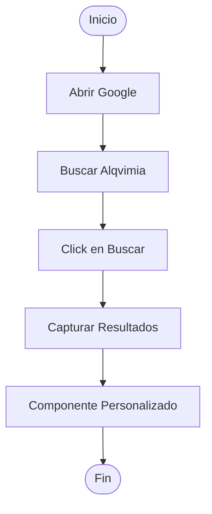

# Workflow de Prueba Exportación

**Creado:** 13/12/2025, 18:17:40

**Total de pasos:** 5

---

## Diagrama de Flujo



---

## Descripción de Pasos

### 1. Abrir Google

**Tipo:** `browser_open`

**Configuración:**

```json
{
  "url": "https://www.google.com",
  "browser": "chrome"
}
```

### 2. Buscar Alqvimia

**Tipo:** `type`

**Configuración:**

```json
{
  "selector": "input[name='q']",
  "text": "Alqvimia RPA",
  "delay": 100
}
```

### 3. Click en Buscar

**Tipo:** `click`

**Configuración:**

```json
{
  "selector": "input[type='submit']",
  "waitTime": 2000
}
```

### 4. Capturar Resultados

**Tipo:** `screenshot`

**Configuración:**

```json
{
  "path": "resultados.png",
  "fullPage": false
}
```

### 5. Componente Personalizado

**Tipo:** `componente_custom_test`

**Configuración:**

```json
{
  "parametro1": "valor1",
  "parametro2": "valor2"
}
```

---

*Generado con Alqvimia RPA*
